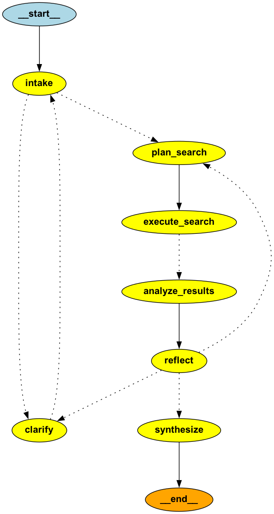

# GemiGraph — AI Research Agent

A full-stack AI research agent powered by **Google Gemini**, **LangGraph**, and **Exa Search**. The agent autonomously plans searches, gathers web sources, analyzes results, reflects on quality, and synthesizes comprehensive answers — with human-in-the-loop clarification when needed.

## Agent Flow

The research agent is built as a LangGraph state machine with the following nodes:



### How It Works

| Step | Node                        | Description                                                                                                                                         |
| ---- | --------------------------- | --------------------------------------------------------------------------------------------------------------------------------------------------- |
| 1    | **Intake**                  | Analyzes the user's research query. Decides whether the query is clear enough to search or needs clarification.                                     |
| 2    | **Clarify** _(conditional)_ | Interrupts execution and asks the user a clarification question. Resumes once the user responds.                                                    |
| 3    | **Plan Search**             | Generates 2–5 focused search queries using Gemini. On subsequent iterations, refines queries based on reflection gaps.                              |
| 4    | **Execute Search**          | Runs all planned queries against the Exa search API in parallel. Handles errors gracefully.                                                         |
| 5    | **Analyze Results**         | LLM analyzes all search results and produces a draft answer with inline `[Source N]` citations.                                                     |
| 6    | **Reflect**                 | Critically evaluates the draft for completeness, accuracy, and gaps. Decides to: iterate (back to Plan Search), ask for clarification, or finalize. |
| 7    | **Synthesize**              | Produces the final polished answer with numbered citations and a Sources section.                                                                   |

The agent supports up to **3 iterations** of the search → analyze → reflect loop, progressively improving the answer.

## Architecture

```
┌─────────────────────┐       ┌─────────────────────┐
│   Next.js Frontend  │──────▶│   FastAPI Backend    │
│   (React + AI SDK)  │  SSE  │   (LangGraph Agent)  │
│   Port 3000         │◀──────│   Port 8000          │
└─────────────────────┘       └────────┬────────────┘
                                       │
                              ┌────────▼────────────┐
                              │   External Services  │
                              │  • Google Gemini API │
                              │  • Exa Search API    │
                              │  • LangSmith (trace) │
                              └─────────────────────┘
```

## Prerequisites

- [Docker](https://docs.docker.com/get-docker/) & [Docker Compose](https://docs.docker.com/compose/install/)
- API keys (see below)

## API Keys

| Key                            | Required | Where to get it                                        | Used by                  |
| ------------------------------ | -------- | ------------------------------------------------------ | ------------------------ |
| `GOOGLE_GENERATIVE_AI_API_KEY` | **Yes**  | [Google AI Studio](https://aistudio.google.com/apikey) | Both (Next.js + FastAPI) |
| `GOOGLE_API_KEY`               | **Yes**  | Same as above (set to the same value)                  | FastAPI                  |
| `EXA_API_KEY`                  | **Yes**  | [Exa Dashboard](https://dashboard.exa.ai/api-keys)     | FastAPI                  |
| `LANGSMITH_KEY`                | Optional | [LangSmith](https://smith.langchain.com)               | FastAPI (agent tracing)  |
| `LANGCHAIN_PROJECT`            | Optional | Any string (default: `gemigraph-research-agent`)       | FastAPI                  |

## Quick Start

### 1. Clone & configure secrets

```bash
git clone <your-repo-url> && cd gemini-hack

# Copy the example env file and fill in your API keys
cp .env.example .env
```

Edit `.env` and paste your actual API keys:

```env
GOOGLE_GENERATIVE_AI_API_KEY=AIza...
GOOGLE_API_KEY=AIza...
EXA_API_KEY=20408391-...
LANGSMITH_KEY=lsv2_pt_...        # optional
LANGCHAIN_PROJECT=gemigraph-research-agent
```

> **Security:** The `.env` file is git-ignored. Never commit API keys to version control.

### 2. Run with Docker Compose

```bash
docker compose up --build
```

This starts:

- **Next.js** frontend at [http://localhost:3000](http://localhost:3000)
- **FastAPI** backend at [http://localhost:8000](http://localhost:8000)

To run in the background:

```bash
docker compose up --build -d
```

### 3. Stop

```bash
docker compose down
```

## LangSmith Tracing

When `LANGSMITH_KEY` is set, the FastAPI agent automatically enables [LangSmith](https://smith.langchain.com) tracing. Every agent run is traced end-to-end — you can inspect:

- Each LangGraph node execution (intake → plan → search → analyze → reflect → synthesize)
- LLM calls with full prompts and responses
- Tool invocations (Exa search calls)
- Interrupt/resume flows for human-in-the-loop clarification
- Token usage and latency per step

View your traces at: **https://smith.langchain.com** → Project: `gemigraph-research-agent`

## Local Development (without Docker)

### Frontend

```bash
pnpm install
pnpm dev:next
```

### Backend

```bash
python -m venv .venv
source .venv/bin/activate
pip install -r requirements.txt

# Set environment variables (or use .env.local)
cd src/api && python -m uvicorn main:app --host 0.0.0.0 --port 8000 --reload
```

Or run both concurrently:

```bash
pnpm dev
```

## Project Structure

```
├── Dockerfile.nextjs          # Multi-stage Next.js build (pnpm)
├── Dockerfile.fastapi         # FastAPI container
├── docker-compose.yml         # Orchestration
├── .env.example               # Template for required secrets
├── requirements.txt           # Python dependencies
├── package.json               # Node.js dependencies
├── src/
│   ├── api/                   # FastAPI backend
│   │   ├── main.py            # Server + SSE streaming + CLI
│   │   └── research_agent/
│   │       ├── graph.py       # LangGraph state machine
│   │       ├── nodes.py       # Node implementations (intake, search, reflect...)
│   │       ├── state.py       # TypedDict state definitions
│   │       └── tools.py       # Exa search tools
│   ├── app/                   # Next.js app router
│   │   ├── page.tsx           # Landing page
│   │   ├── chat/              # Chat UI
│   │   └── api/chat/          # API route (proxies to FastAPI)
│   ├── components/            # React components
│   ├── hooks/                 # Custom hooks
│   ├── lib/                   # Utilities
│   ├── store/                 # Zustand state management
│   └── types/                 # TypeScript types
└── public/
    └── agent-flow.png         # Generated LangGraph flow diagram
```

## Tech Stack

- **Frontend:** Next.js 16, React 19, Tailwind CSS, Vercel AI SDK, Zustand
- **Backend:** FastAPI, LangGraph, LangChain, Google Gemini 3.1 Pro
- **Search:** Exa AI
- **Tracing:** LangSmith
- **Containerization:** Docker, Docker Compose
